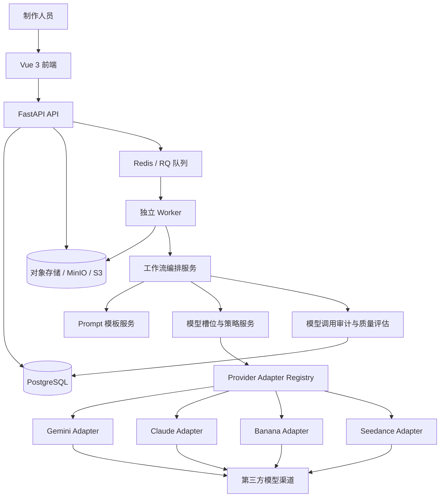
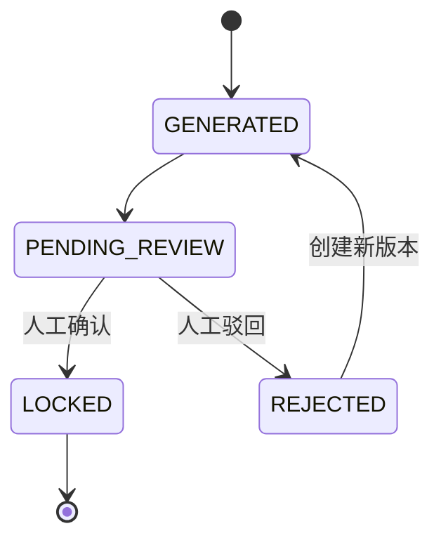
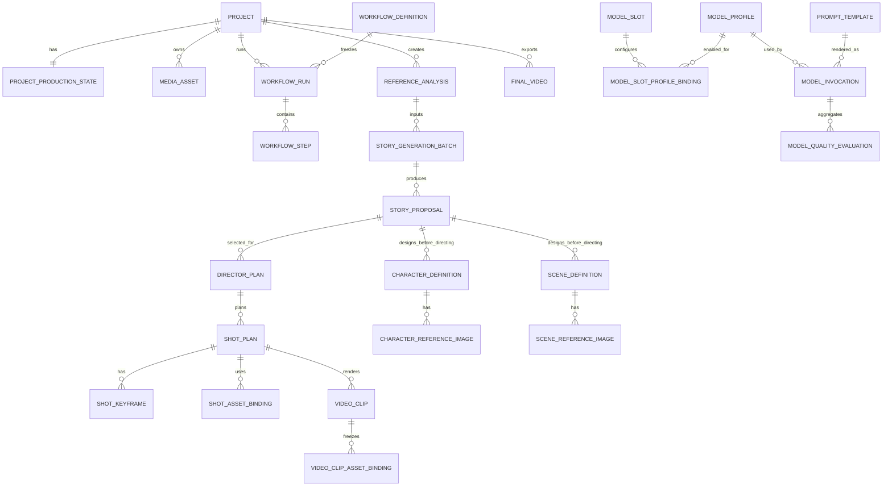

# LemonFlow V1 架构设计（已实施基线）

> 文档状态：`已确认并已实施，作为 V1 架构基线`  
> 适用范围：LemonFlow V1 主生产链路  
> 实施状态：数据库迁移已至 `0007_v1_production_integrity`；状态机、版本冻结、幂等、镜头视频子任务与本地 Mock 自动化验证已完成。真实模型 Key 和真实供应商小样本验收尚需由负责人授权执行。

## 1. 产品定位与架构原则

LemonFlow V1 是一个**多模型协作、带人工审核节点、可追溯与可优化的 AI 视频生产工作流平台**。它不是单一图片转视频工具，也不绑定某一个模型供应商。

V1 的生产原则：

- 主流程必须有人工闸门：分析确认、故事选择、基础图片资产锁定、分镜图锁定、视频审核。
- 业务服务只依赖模型能力槽位，不直接依赖 Gemini、Claude、Banana 或 Seedance 的 HTTP 协议。
- 每次执行冻结 Workflow 版本、模型配置版本、Prompt 模板版本及其渲染参数。
- 所有已锁定或已审核通过的结果不可覆盖；重新生成永远创建新版本。
- V1 只提供模型效果分析和推荐，**不得自动替换生产模型**。
- 参考视频只提炼可迁移的结构与机制；不得复刻原视频的逐字台词、人物、画面、音乐或剧情表达。

## 2. V1 正式主流程

```mermaid
flowchart LR
    A["上传授权参考视频"] --> B["Gemini 视频分析"]
    B --> C["人工确认并锁定创作简报"]
    C --> D["多模型并行生成原创故事"]
    D --> E["人工选择故事方案"]
    E --> F["角色资产设计"]
    F --> G["角色参考图生成与锁定"]
    G --> H["场景资产设计"]
    H --> I["场景参考图生成与锁定"]
    I --> J["AI 导演分镜规划"]
    J --> K["分镜关键画面生成与锁定"]
    K --> L["Seedance 视频片段生成"]
    L --> M["人工审核视频片段"]
    M --> N["合成最终成片"]
```



### 2.1 默认模型策略

| 能力槽位 | V1 默认候选 | 策略 |
|---|---|---|
| 视频分析 | Gemini 3.1 Pro Preview | 单模型 |
| 故事生成 | Claude Sonnet 4.6、Claude Opus 4.6、Gemini 3.1 Pro Preview | 三模型并行 |
| 角色设计 | 在模型中心为 `CharacterDesignModel` 配置 | 单模型 |
| 场景设计 | 在模型中心为 `SceneDesignModel` 配置 | 单模型 |
| 导演分镜 | 在模型中心为 `DirectorPlanModel` 配置 | 单模型 |
| 角色/场景/关键帧图片 | Banana 2 | 单模型；后续可切换为多候选 |
| 视频生成 | `doubao-seedance-2-0-mini-260615` | 单模型 |
| 成片合成 | FFmpeg | 本地非 AI 能力 |

角色设计、场景设计与导演分镜为独立模型槽位。V1 可以把它们绑定到同一配置，但不在业务代码中默认绑定某个具体模型。

### 2.2 审核闸门

| 闸门 | 人工操作 | 放行条件 |
|---|---|---|
| 分析审核 | 确认或驳回分析结果 | 一份 `ReferenceAnalysis` 已锁定 |
| 故事选择 | 从并行候选中选择一份 | 一份 `StoryProposal` 已选中 |
| 角色资产锁定 | 每个角色选择一个参考图版本 | 所有参与分镜的角色均有锁定图 |
| 场景资产锁定 | 每个场景选择一个参考图版本 | 所有参与分镜的场景均有锁定图 |
| 分镜图锁定 | 每个分镜选择一个关键画面版本 | 所有待生成视频的分镜均有锁定关键帧 |
| 视频审核 | 通过、驳回或重做视频片段 | 所有目标片段均审核通过 |

## 3. 系统整体架构



### 3.1 分层边界

| 层 | 职责 | 不应承担的职责 |
|---|---|---|
| 前端 | 展示流程、收集人工审核决定、预览资产与成片 | 保存 API Key、直接调用模型供应商 |
| API | 校验权限和前置条件、创建任务、返回业务状态 | 在 HTTP 请求内执行长时间生成 |
| Worker | 调用模型、轮询异步任务、写入标准化结果 | 决定人工审核结论 |
| 工作流服务 | 编排阶段与闸门、冻结输入快照 | 理解供应商的专有请求格式 |
| Provider Adapter | 请求转换、供应商调用、响应标准化 | 处理项目业务状态或页面流程 |
| 配置/Prompt 服务 | 选择版本、校验变量、生成不可变快照 | 持有真实密钥 |

## 4. Workflow 版本管理

### 4.1 定义

Workflow 必须版本化，避免未来 V2 的自动审核、自动模型推荐或自动 Prompt 优化影响 V1 历史项目。

新增：

`workflow_definitions`

| 字段 | 说明 |
|---|---|
| `id` | 主键 |
| `workflow_code` | 固定逻辑名称，例如 `LEMONFLOW_PRODUCTION` |
| `version` | 版本，例如 `LemonFlow_V1`、`LemonFlow_V2` |
| `definition_json` | 阶段、前置条件、允许的审核动作、默认模型槽位策略 |
| `status` | `DRAFT`、`PUBLISHED`、`ARCHIVED` |
| `published_at` | 发布时间 |
| `created_at`、`updated_at` | 审计时间 |

`workflow_runs` 新增：

| 字段 | 说明 |
|---|---|
| `workflow_definition_id` | 本次运行使用的 Workflow 定义 |
| `workflow_version` | 冗余冻结值，例如 `LemonFlow_V1` |
| `input_snapshot` | 工作流启动时的非敏感输入快照 |

规则：发布中的 Workflow 定义不可编辑。修改流程必须复制为新版本，再发布。

### 4.2 V1 阶段定义

| 阶段代码 | 名称 | 进入条件 | 离开条件 |
|---|---|---|---|
| `REFERENCE_ANALYSIS` | 参考视频分析 | 已上传视频 | 分析任务成功 |
| `ANALYSIS_REVIEW` | 分析审核 | 已有分析草稿 | 分析已锁定 |
| `STORY_GENERATION` | 多模型故事生成 | 已锁定分析 | 批次生成结束 |
| `STORY_REVIEW` | 故事选择 | 已有候选故事 | 已选中故事 |
| `CHARACTER_ASSETS` | 角色资产 | 已选中故事 | 所有必需角色图锁定 |
| `SCENE_ASSETS` | 场景资产 | 角色资产已锁定 | 所有必需场景图锁定 |
| `DIRECTOR_PLANNING` | 导演分镜 | 角色与场景资产已锁定 | 导演分镜已生成 |
| `SHOT_KEYFRAMES` | 分镜关键画面 | 已有导演分镜 | 所有目标关键帧锁定 |
| `VIDEO_GENERATION` | 视频生成 | 关键帧已锁定 | 视频任务结束 |
| `VIDEO_REVIEW` | 视频审核 | 已有成功视频片段 | 所有目标片段审核通过 |
| `FINAL_EXPORT` | 成片导出 | 视频片段审核通过 | 成片成功 |

## 5. 状态流转设计

任务执行状态与人工审核状态必须分离。



### 5.1 状态枚举

| 对象 | 生成状态 | 审核状态 |
|---|---|---|
| 分析结果 | `PENDING`、`RUNNING`、`SUCCEEDED`、`FAILED` | `PENDING_REVIEW`、`LOCKED`、`REJECTED` |
| 故事方案 | `CANDIDATE` | `SELECTED`、`REJECTED` |
| 图片资产 | `PENDING`、`RUNNING`、`SUCCEEDED`、`FAILED` | `PENDING_REVIEW`、`LOCKED`、`REJECTED` |
| 视频片段 | `PENDING`、`RUNNING`、`SUCCEEDED`、`FAILED` | `PENDING_REVIEW`、`APPROVED`、`REJECTED` |
| 成片 | `PENDING`、`RUNNING`、`SUCCEEDED`、`FAILED` | 不单独增加审核状态；新版本成片保留历史 |

## 6. 数据库 ER 设计



### 6.1 核心业务表

| 表 | 核心字段 | 说明 |
|---|---|---|
| `project_production_states` | `project_id`、`active_stage`、`locked_analysis_id`、`selected_story_id`、`director_plan_id` | 当前生产指针；页面状态展示使用 |
| `reference_analyses` | `video_script_structure`、`opening_analysis`、`viral_elements`、`scene_analysis`、`creative_brief`、`version`、`review_status` | Gemini 标准化分析输出；锁定后不可修改 |
| `review_decisions` | `target_type`、`target_id`、`decision`、`note`、`reviewed_at` | 通用审核事件；不因 V1 暂无登录而省略审计 |
| `story_generation_batches` | `reference_analysis_id`、`requested_profile_ids`、`workflow_run_id` | 一次并行故事生成任务 |
| `story_proposals` | `batch_id`、`model_invocation_id`、`content`、`status` | 每个模型的一份候选故事 |
| `director_plans` | `story_proposal_id`、`visual_bible`、`status` | 基于已锁定角色/场景资产生成的导演分镜方案 |
| `character_definitions` | `story_proposal_id`、`name`、`age`、`appearance`、`costume`、`temperament`、`locked_reference_image_id` | 角色文字设定在导演分镜前生成；指针选择本轮角色图 |
| `scene_definitions` | `story_proposal_id`、`name`、`location`、`environment`、`style`、`mood`、`locked_reference_image_id` | 场景文字设定在导演分镜前生成；指针选择本轮场景图 |
| `shot_plans` | `director_plan_id`、`shot_number`、`action`、`camera`、`duration`、`video_action_prompt`、`locked_keyframe_id`、`selected_video_clip_id` | 每个导演分镜；只由该指针选择一个当前采用视频版本 |
| `character_reference_images` | `character_id`、`version`、`prompt`、`image_url`、`review_status` | 角色参考图不可变版本 |
| `scene_reference_images` | `scene_id`、`version`、`prompt`、`image_url`、`review_status` | 场景参考图不可变版本 |
| `shot_keyframes` | `shot_id`、`version`、`prompt`、`image_url`、`review_status` | 分镜关键画面不可变版本 |
| `shot_asset_bindings` | `shot_id`、`character_id`、`character_reference_image_id`、`scene_reference_image_id` | 明确分镜引用了哪些锁定基础资产 |
| `video_clips` | `shot_id`、`version`、`video_url`、`provider_task_id`、`idempotency_key`、`generation_status`、`review_status` | 一个导演分镜可有多个历史版本；仅 `ShotPlan.selected_video_clip_id` 所指向且已通过审核的版本可参与成片 |
| `video_clip_asset_bindings` | `video_clip_id`、`asset_type`、`character_reference_image_id` / `scene_reference_image_id` / `shot_keyframe_id` | 通过三类明确外键冻结视频调用实际输入的图片资产 |
| `final_videos` | `project_id`、`version`、`approved_clip_ids`、`output_url` | 只由已审核通过片段合成 |

### 6.2 模型与质量表

| 表 | 核心字段 | 说明 |
|---|---|---|
| `model_slots` | `slot_key`、`capability`、`selection_mode` | 模型能力槽位；模式为 `SINGLE`、`MULTI_PARALLEL`、`AB_TEST` |
| `model_profiles` | `adapter_key`、`model_key`、`model_version`、`provider_config`、`version` | 非敏感模型配置版本；真实 Key 只存环境变量 |
| `model_slot_profile_bindings` | `slot_id`、`profile_id`、`enabled`、`priority`、`weight` | 一个槽位可绑定一个或多个配置 |
| `model_invocations` | `slot_id`、`profile_snapshot`、`prompt_snapshot`、`input_snapshot`、`usage`、`cost`、`latency`、`result_ref` | 每次模型调用的完整可追溯记录 |
| `model_quality_evaluations` | `profile_id`、`task_type`、`sample_count`、`success_rate`、`avg_cost`、`avg_human_score`、`adoption_rate` | 按模型与任务类型聚合的质量报告 |

## 7. Prompt 模板版本管理

### 7.1 设计目标

生产 Prompt 不得硬编码在业务服务中。Prompt 是和模型配置同等重要的生产资产，必须可版本化、验证、回滚和评估。

新增：`prompt_templates`

| 字段 | 说明 |
|---|---|
| `id` | 主键 |
| `task_type` | `VIDEO_ANALYSIS`、`STORY_GENERATE`、`CHARACTER_DESIGN`、`SCENE_DESIGN`、`DIRECTOR_PLAN`、`SHOT_GENERATE` 等 |
| `name` | 人类可读名称，例如“故事生成标准版” |
| `version` | 版本号，例如 `v1`、`v2`、`v3` |
| `content` | 模板正文，支持受控变量 |
| `variables_schema` | JSON Schema，定义允许输入的变量与类型 |
| `status` | `DRAFT`、`ACTIVE`、`ARCHIVED` |
| `created_at`、`updated_at` | 时间审计 |

建议唯一约束：`task_type + name + version`。

### 7.2 调用冻结规则

每次 `ModelInvocation` 必须保存：

- `prompt_template_id`
- `prompt_template_version`
- `prompt_content_snapshot`
- `rendered_variables_snapshot`
- `rendered_prompt_hash`

模板激活后不可原地修改。修改 Prompt 必须复制创建新版本。模板变量在调用前按 `variables_schema` 校验；生产环境不得存在“无模板直接调用模型”的兜底路径。

### 7.3 Prompt 评估

`ModelQualityEvaluation` 的聚合维度至少包括：

```text
任务类型 + 模型配置版本 + Prompt 模板版本 + 测试场景
```

这样可以区分“模型变好”与“Prompt 变好”，也可以回溯任何一个成片到底使用了哪套提示词。

## 8. 模型槽位、策略与 Adapter 设计

### 8.1 槽位策略

| 策略 | 含义 | V1 使用位置 |
|---|---|---|
| `SINGLE` | 每次只调用一个启用模型 | 视频分析、视频生成、导演分镜 |
| `MULTI_PARALLEL` | 同一输入并行调用多个模型 | 故事生成 |
| `AB_TEST` | 仅在测试项目中按配额分流 | 图片模型的后续试验 |

V1 的模型策略页面只显示数据与推荐，例如“Gemini 成本低、Claude Opus 人工评分高”。**系统不得自动修改任何生产槽位的绑定。** 是否切换由人工在模型中心完成。

### 8.2 Adapter 契约

```text
VideoAnalysisAdapter.analyze(input) -> ReferenceAnalysisOutput + InvocationUsage
StoryGenerationAdapter.generate(input) -> StoryProposalOutput + InvocationUsage
CharacterDesignAdapter.generate(input) -> CharacterDefinitions + InvocationUsage
SceneDesignAdapter.generate(input) -> SceneDefinitions + InvocationUsage
DirectorPlanAdapter.generate(input) -> DirectorPlanOutput + InvocationUsage
ImageGenerationAdapter.generate(input) -> ImageAssetOutput + InvocationUsage
VideoGenerationAdapter.submit(input) -> ProviderTask
VideoGenerationAdapter.poll(task) -> VideoAssetOutput + InvocationUsage
```

Adapter 负责 API 调用、参数转换、供应商错误映射与返回结果标准化。业务服务只依赖这些契约。

已实现的 `volcengine_ark_video` Adapter 封装了 Seedance 火山方舟的提交、轮询、首帧和视频地址解析能力；业务层只从已锁定资产绑定和 `WorkflowRun` 冻结快照读取输入。

## 9. API 接口设计（当前实现）

实际接口统一以 `/api/v1/production` 为前缀，完整参数和响应以启动后的 `/docs` 为准。

### 9.1 生产台、生成任务与审核

```text
GET  /projects/{project_id}/state
POST /projects/{project_id}/generation-runs/{run_key}
GET  /projects/{project_id}/reference-analyses
POST /reference-analyses/{analysis_id}/lock
POST /reference-analyses/{analysis_id}/reject
GET  /projects/{project_id}/story-proposals
POST /story-proposals/{proposal_id}/select
GET  /projects/{project_id}/character-reference-images
POST /character-reference-images/{image_id}/lock
GET  /projects/{project_id}/scene-reference-images
POST /scene-reference-images/{image_id}/lock
GET  /projects/{project_id}/shot-keyframes
POST /shot-keyframes/{image_id}/lock
GET  /projects/{project_id}/video-clips
POST /video-clips/{clip_id}/approve
POST /video-clips/{clip_id}/reject
GET  /projects/{project_id}/model-invocations
```

`run_key` 只能是服务端声明的 V1 节点。创建时服务端冻结 Workflow、素材、模型、Prompt 和上游锁定资产，并在已有 `PENDING`/`RUNNING` 运行时返回既有任务。视频生成可传指定 `shot_plan_ids`，用于单镜头重做。

### 9.2 模型、Prompt 与质量

```text
GET  /workflow-definition
GET  /model-slots
POST /model-slots/{slot_key}/strategy
POST /model-slots/{slot_key}/bindings
GET  /v1-model-profiles
POST /v1-model-profiles
GET  /prompt-templates
POST /prompt-templates
POST /prompt-templates/{template_id}/activate
POST /prompt-templates/{template_id}/archive
GET  /model-quality-evaluations
POST /model-quality-evaluations/refresh
```

模型和 Prompt 接口不接收真实 Key，也不允许浏览器通过请求指定某家供应商。质量刷新只汇总既有 `ModelInvocation` 与审核记录，绝不重跑模型或自动切换槽位。

## 10. 前端页面改造方案

| 页面 | 主功能 | 必须展示的审核信息 |
|---|---|---|
| 项目生产台 | 全流程状态、下一步入口、阻塞原因 | 当前 Workflow 版本、当前阶段、已冻结对象 |
| 参考视频分析 | 查看五类分析结果、确认、驳回、重跑 | 模型、Prompt、耗时、成本、锁定状态 |
| 故事方案中心 | 并排比较多模型故事候选并选中 | 模型、Prompt、成本、耗时、人工评分、采用状态 |
| 角色资产中心 | 角色文字设定、角色图版本、锁定 | 每个角色的锁定参考图 |
| 场景资产中心 | 场景文字设定、场景图版本、锁定 | 每个场景的锁定参考图 |
| AI 导演分镜 | 角色/场景引用、镜头、动作、机位 | 分镜绑定的锁定资产 |
| 分镜画面中心 | 关键帧版本比较与锁定 | 关键帧的角色、场景来源 |
| 视频审核中心 | 视频预览、通过、驳回、重做 | 输入资产版本、模型、任务号、审核意见 |
| 成片导出中心 | 已通过片段、导出、下载、历史成片 | 使用的视频片段版本清单 |
| 模型中心 | 槽位、模型绑定、单/多模型策略 | 不自动切换提示、质量和成本推荐 |
| Prompt 中心 | 模板版本、变量定义、激活与归档 | 模板使用次数、质量趋势 |

## 11. 旧模块迁移方案

| 旧模块 | 迁移策略 |
|---|---|
| 项目、上传、对象存储、队列、Worker | 保留并复用 |
| `workflow_runs`、`workflow_steps` | 保留，增加 Workflow 版本冻结字段 |
| 现有视频分析服务 | 拆为媒体预处理服务与 `VideoAnalysisService` |
| 原创选题 | 从主流程移出，保留为可选灵感工具 |
| 旧故事包 | 保留历史数据；V1 新项目使用 `story_proposals` |
| 旧分镜包 | 保留历史数据；V1 使用导演方案与分镜表 |
| 单镜图片表 | 保留历史数据；V1 使用角色图、场景图、关键帧表 |
| 现有 Seedance 服务 | 保留原生火山方舟协议，改造输入为锁定资产绑定 |
| 现有模型配置中心 | 改为模型槽位、配置版本、策略、Prompt 和质量中心 |
| 手工 `model_evaluations` | 迁移为从 `model_invocations` 自动汇总的质量评估 |

首次迁移不物理删除旧表，不破坏旧项目。旧模块在前端标记为“可选/旧版”，待 V1 稳定并完成数据归档后再决定是否清理。

## 12. 实施情况与后续验收

### 已完成：架构底座

1. 已新增 Workflow 定义与版本冻结。
2. 已新增模型槽位、多模型绑定、模型调用审计。
3. 已新增 Prompt 模板、版本、变量校验与调用快照。
4. 已完成至 `0007` 的数据库迁移和回归测试基线。

### 已完成：分析与故事闭环

1. 已实现供应商无关的视觉分析 Adapter 与标准化分析结果。
2. 已实现分析审核、驳回、锁定。
3. 已实现多模型故事批次、候选比较和故事选择。

### 已完成：资产驱动视觉链路

1. 已实现角色设计、角色参考图和锁定。
2. 已实现场景设计、场景参考图和锁定。
3. 已实现导演分镜、分镜资产绑定和关键帧锁定。
4. 已实现 OpenAI 兼容图片 Adapter，可为 Banana 2 或兼容渠道创建配置。

### 已完成：视频与成片闭环

1. Seedance 输入已切换为锁定资产绑定和冻结快照。
2. 已实现视频片段审核、驳回和单镜头新版本重做。
3. 成片只使用每个镜头当前采用且审核通过的片段。

### 已完成：前端、质量和交付；待执行真实小样本验收

1. 已完成项目生产台及所有审核页面。
2. 已实现模型/Prompt 质量和成本看板。
3. 已更新零基础用户手册、部署文档、模块 README。
4. 本地 Mock、迁移、媒体、幂等、视频驳回重做和前端构建已验证；真实渠道小样本验收待负责人配置 Key 后执行。

## 13. 真实小样本验收前需确认的外部资料

真实模型调用前，需要由负责人确认每个渠道的实际 API 文档、可用模型标识、密钥环境变量名称、计费返回字段和输入限制：

- Gemini 视频分析渠道；
- Claude Sonnet/Opus 渠道；
- Banana 2 图片生成渠道；
- Seedance 已有火山方舟渠道可继续复用。

这些资料只影响模型中心配置、Adapter 参数和小样本验收，不改变本文的业务流程、数据关系或审核规则。V1 不会在没有明确授权的情况下调用真实供应商或产生费用。
